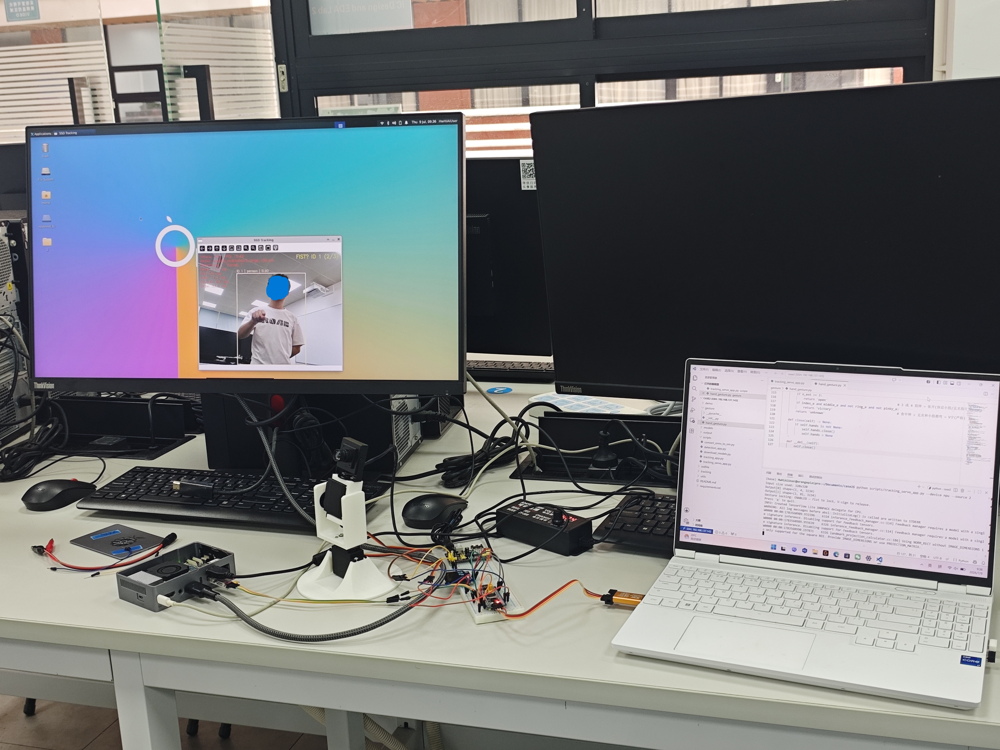

# 基于昇腾310B的目标跟踪检测系统

> **选题**：题目4：昇腾310B目标跟踪检测  
> **小组成员**：吴铭帆、梁乐天、张泽滨  

---

## 项目概述

本项目基于 **昇腾310B（OrangePi AIpro / Atlas 200 DK）** 开发板，利用 **MobileNet-SSD** 轻量级检测模型在 NPU 上进行实时目标检测，结合 **DeepSORT** 跟踪算法（卡尔曼滤波 + 匈牙利算法）实现多目标轨迹追踪。检测与跟踪结果通过串口发送至 **STM32F103C8T6**，驱动二轴舵机云台随目标转动，使目标始终保持在画面中心区域。

同时集成 **MediaPipe Hands** 手势识别，支持握拳锁定目标、张开手手动俯仰控制、比耶取消等交互功能。



---

## 系统架构

```
┌─────────────────────────────────────────────────────────────┐
│                    OrangePi AIpro (昇腾310B)                │
│  ┌──────────┐   ┌────────────┐     ┌──────────┐             │
│  │ USB Camera│──▶│MobileNet   │──▶│ DeepSORT │             │
│  │ (视频流)  │   │ -SSD NPU   │     │ 跟踪器    │             │
│  └──────────┘   │ 推理       │      │ (卡尔曼+  │             │
│                 └────────────┘     │ 匈牙利)  │              │
│                                     └─────┬────┘            │
│                               ┌─────────┴─────────┐         │
│                               │  手势交互(可选)    │         │
│                               │  MediaPipe Hands  │         │
│                               └─────────┬─────────┘         │
│                                         │ 串口              │
│                                         ▼ (角度+ID)         │
└────────────────────────────────────┬────────────────────────┘
                                     │ UART-TTL (115200)
┌────────────────────────────────────▼────────────────────────┐
│                   STM32F103C8T6                              │
│  ┌────────────┐   ┌──────────┐   ┌───────────┐              │
│  │ 串口接收   │──▶│ 死区+    │──▶│ PWM输出   │              │
│  │ (状态机)   │   │ 限幅控制 │   │ (50Hz)    │              │
│  └────────────┘   └──────────┘   └─────┬─────┘              │
│  ┌────────────┐                        │                    │
│  │ OLED显示   │  (I2C SSD1306)         │                    │
│  │ PAN/TILT/ID│                        │                    │
│  └────────────┘                        │                    │
└────────────────────────────────────────┼────────────────────┘
                                         ▼
                               ┌─────────────────────┐
                               │  二轴舵机云台        │
                               │  SG90 × 2           │
                               │  水平(Pan) + 俯仰   │
                               └─────────────────────┘
```

---

## 硬件清单

| 序号 | 物料名称 | 型号/规格 | 数量 |
|:---:|:---------|:----------|:----:|
| 1 | AI 开发板 | OrangePi AIpro（昇腾310B） | 1 |
| 2 | 辅助 MCU | STM32F103C8T6 最小系统板 | 1 |
| 3 | USB 摄像头 | 640×480+ | 1 |
| 4 | 舵机 | SG90 180° | 2 |
| 5 | 二轴云台支架 | 两自由度云台 | 1 |
| 6 | 调试器 | ST-Link V2 | 1 |
| 7 | 串口模块 | USB 转 TTL（CH340G） | 1 |
| 8 | OLED 显示屏 | 1.3寸 OLED（I2C） | 1 |
| 9 | 面包板 + 杜邦线 | 若干 | 1 套 |
| 10 | 外部电源 | 电源适配器接电源模块输出5V | 1 |

---

## 软件栈

| 组件 | 技术选型 |
|:--- |:---------|
| AI 推理框架 | **CANN 8.0** + PyACL |
| 目标检测模型 | MobileNet-SSD（OM 格式） |
| 目标跟踪算法 | DeepSORT（卡尔曼滤波 + 匈牙利匹配） |
| 手势识别 | MediaPipe Hands |
| 昇腾端语言 | Python 3.9+ |
| STM32 端语言 | C（HAL 库） |
| 计算机视觉 | OpenCV 4.8+ |
| 串口通信 | pyserial / STM32 USART |
| MCU 开发 | VS CODE + CMake +stm32cubegrammar|

---

## 功能特性

### 昇腾310B 端

- **SSD 目标检测** — MobileNet-SSD NPU 推理，支持指定跟踪类别
- **DeepSORT 多目标跟踪** — 卡尔曼滤波预测 + IOU/中心距离匹配 + 匈牙利算法
- **舵机自动跟踪** — 目标跟踪点 EMA 平滑 + 死区 + 非线性变增益 + 卡尔曼速度前瞻
- **手势交互**（MediaPipe）:
  - 🥊 **握拳** — 锁定目标（连续 3 帧防抖）
  - ✌️ **比耶** — 取消锁定 / 退出手动模式
  - 🖐️ **张开手** — 手动俯仰上下控制
  - ⌨️ **按键 1** — 切换手动俯仰模式 ON/OFF
- **串口通信** — 6 字节帧协议 `[0xAA][0x55][pan][tilt][track_id][checksum]`

### STM32 端

- **串口接收** — UART 中断 + 状态机帧同步，自动抗丢字节错位
- **PWM 舵机驱动** — TIM2 双通道 50Hz，脉宽 500~2500μs（0°~180°）
- **保护控制** — 死区 ±2° + 步长限幅 + 机械方向补偿
- **OLED 显示** — 实时显示 PAN / TILT / 目标 ID
- **LED 三态诊断** — 常亮=正常 / 慢闪=协议异常 / 快闪=无数据

---

## 串口通信协议

**6 字节帧（波特率 115200）：**

| Byte | 值 | 含义 |
|:---:|:---|:-----|
| 0 | `0xAA` | 帧头 1 |
| 1 | `0x55` | 帧头 2 |
| 2 | 0~180 | 水平角度（pan） |
| 3 | 0~180 | 俯仰角度（tilt） |
| 4 | 0~255 | 当前跟踪目标 ID（0=无目标） |
| 5 | checksum | `(pan + tilt + id) & 0xFF` |

---

## 操作指南

| 操作 | 效果 |
|:---|:-----|
| 🥊 **握拳** | 锁定画面中握拳的人（连续 3 帧确认） |
| ⌨️ **按 1** | 切换手动俯仰模式 ON/OFF |
| 🖐️ **张开手朝上** | 手动模式中，tilt 上移 |
| 🖐️ **张开手朝下** | 手动模式中，tilt 下移 |
| ✌️ **比耶**（手动模式） | 退出手动模式 → 回锁定 |
| ✌️ **比耶**（普通锁定）| 取消锁定 → 回 AUTO |
| ⌨️ **按 Q** | 退出程序 |

---

## 硬件连接

```
昇腾310B UART TX ──→ USB-TTL(CH340) RXD
USB-TTL TXD ──→ STM32F103 PA10 (USART1_RX)

STM32 PA0 (TIM2_CH1) ──→ 舵机 1 信号线（水平 Pan）
STM32 PA1 (TIM2_CH2) ──→ 舵机 2 信号线（垂直 Tilt）

STM32 PB8 (I2C1_SCL) ──→ OLED SCL
STM32 PB9 (I2C1_SDA) ──→ OLED SDA

电源适配器接电源模块输出5V ──→ 舵机 VCC（独立供电）
GND 共地：昇腾、STM32、舵机、USB-TTL、电源
```

---

## 许可

本项目为课程设计作品，仅供学习参考。
